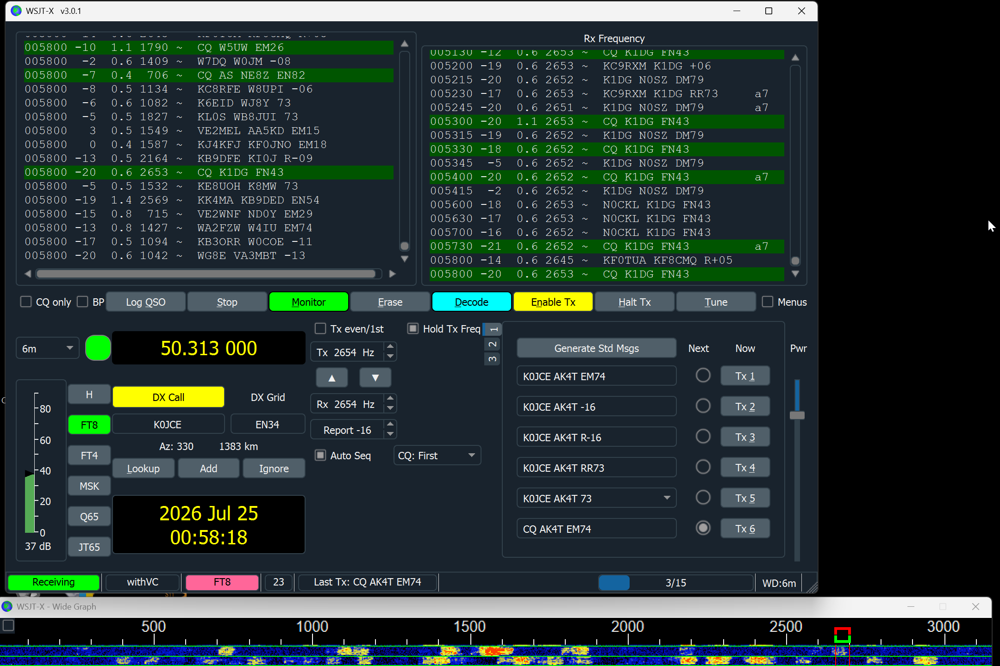

# pyvnc

A small, single-file VNC (RFB 3.8) viewer in pure Python with real
**Tight encoding** support — no VNC library, just Pillow + the standard
library. Built to keep an eye on a headless WSJT-X (amateur radio FT8)
machine on the LAN.



## Features

- **Encodings:** Raw, CopyRect, and full Tight (fill / JPEG / copy /
  palette / gradient sub-encodings, 4 persistent zlib streams,
  JPEG quality + zlib compression level negotiation)
- **VNC password authentication** — DES challenge-response implemented in
  pure Python (no crypto dependencies)
- **Desktop resize** via the DesktopSize pseudo-encoding
- **Fit-to-screen scaling** (default) or a fixed factor; mouse coordinates
  mapped back to remote space, letterbox-aware
- **Fullscreen** toggle with `F11` (aspect preserved)
- **Input:** keyboard, mouse buttons, scroll wheel; server clipboard sync
- **Resilient connection:**
  - a slow server pausing mid-message does *not* kill the session
    (30 s no-progress watchdog instead of naive read timeouts)
  - TCP keepalive detects dead peers (crashed host, dropped network)
  - automatic reconnect with 1→30 s backoff — the last frame stays on
    screen and the title bar shows what's happening
- **tkinter UI** from the standard library; the only install is Pillow
- High-DPI aware on Windows (renders in physical pixels, no blurry stretch)

## Requirements

- Python 3.8+
- `pip install pillow`
- tkinter (bundled with python.org Windows installers; on Debian/Ubuntu:
  `sudo apt install python3-tk`)

## Usage

```console
python vncviewer.py                      # 192.168.1.176:5900, fit to screen
python vncviewer.py 192.168.1.176 -p secret
python vncviewer.py --port 5901 --scale 1.0
python vncviewer.py --selftest           # DES/protocol known-answer test
```

| Option | Default | Meaning |
|---|---|---|
| `host` | `192.168.1.176` | VNC server address |
| `-p`, `--password` | *(prompt if needed)* | VNC password |
| `--port` | `5900` | VNC server port |
| `--scale` | `fit` | `fit` shrinks the remote desktop to your screen; or a number like `0.5`, `1.0`, `2.0` (0.05–4.0) |
| `--selftest` | — | run the built-in DES/VNC-auth known-answer test and exit |

If the server asks for a password and none was given, a dialog prompts for
it. Servers with security type "None" connect straight through.

### Controls

| Input | Action |
|---|---|
| `F11` | toggle fullscreen (local only, not sent to the remote) |
| keyboard | forwarded to the remote (incl. modifiers, F-keys, keypad) |
| mouse move / buttons / wheel | forwarded, mapped through scaling |
| copy on the remote | arrives in your local clipboard |

## How it works

- A **reader thread** owns the socket: handshake → security negotiation →
  `SetPixelFormat` (32 bpp BGRX) → `SetEncodings` → update loop. Framebuffer
  rectangles are decoded into a full-size PIL image.
- The **tkinter main thread** drains an event queue (~200×/s): at scale 1.0
  changed rects are blitted in place via a Tk photo `copy`; when scaled,
  full re-renders are throttled to ~25 fps.
- `run_supervised()` wraps the read loop: any protocol/socket/zlib failure
  tears down just the session, keeps the last frame, and reconnects with
  exponential backoff (reset after 10 s of healthy connection).
- The DES implementation (needed for VNC auth) is table-driven pure Python,
  verified by a FIPS-81 known-answer test in `--selftest`.

## Tests

```console
python test_vncviewer.py        # or: pytest test_vncviewer.py
```

Spins up a fake RFB server on a local socket (no network, no display) and
checks the connection-resilience behavior:

1. a >1 s pause in the *middle* of a framebuffer rect is tolerated
2. the client reconnects and resumes updates after the server drops it
3. with the server gone entirely, the client reports status and still
   shuts down cleanly

`python vncviewer.py --selftest` covers the DES/VNC-auth helpers.

## Files

| File | Purpose |
|---|---|
| `vncviewer.py` | the whole viewer (protocol + UI) |
| `test_vncviewer.py` | fake-server resilience tests |
| `test_capture.png` | screenshot of a live session |
